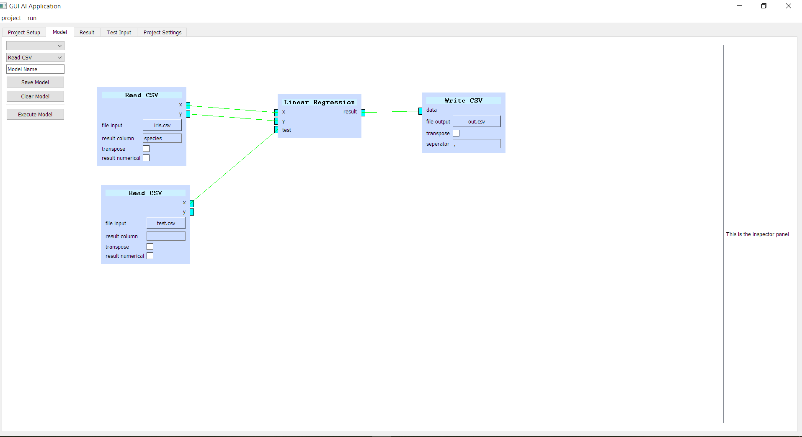

# Hexacone
This is a graphical software for educational and academic purposes to 
make it easier for people to learn Artificial Intelligence (AI),
Machine Learning (ML), and maybe data visualization.

#### Note: this project is still under heavy development  
#### Note: This is a project CODE-NAMED, Hexacone

### General Information
This software is to help people to learn the Artificial Intelligence as
in whole project-wise. Teaches people different kinds of models and how
ML works. And not get confused between AI, Neural Network, and ML.

### Purpose
The purpose of this software is to bridge the gap between
the domain experts (i.e. mathematicians, designer) to the programmers
who programs on Python or C++ that has a large and extensive library
to program an AI.

### Goal
Future goal of this project is so everyone uses Graphical Interface 
(not necessarily this project) to design the AI without any hassle 
to prior knowledge of programming. And also create a "low"-level 
AI designer to be a lot more flexible, creating a variety of AI models,
hence the creation of this project. Flexibility and Simplicity.

### Software Convention
This software is a visually-rich desktop application to utilize
the simplicity yet complexity of a graphic interface. Much like from
using Command Prompts to load and manipulate files to using a
Graphic Interface to easily navigate, maintain, low learning-barrier, etc.

It uses nodes (a little elongated draggable square with inputs and outputs)
to create the project. Each nodes has input and output connector which
connects to output and input respectively.

### Example
Pictures tells more words than a paragraph. As in this case, it does show
some the rusty, messy, early development of this software.

An example of ML in GUI using Linear Regression on iris.csv.

### Requirements
* Python 3.7 Interpreter
* Libraries Required
    * PyQt5
    * SkLearn
* Preferably use virtual-environment to execute your project

### Installation
* Clone this repository
* Goto the project directory
* Run `python src/main.py`

### License
Apache License  
Version 2.0, January 2004  
http://www.apache.org/licenses/  